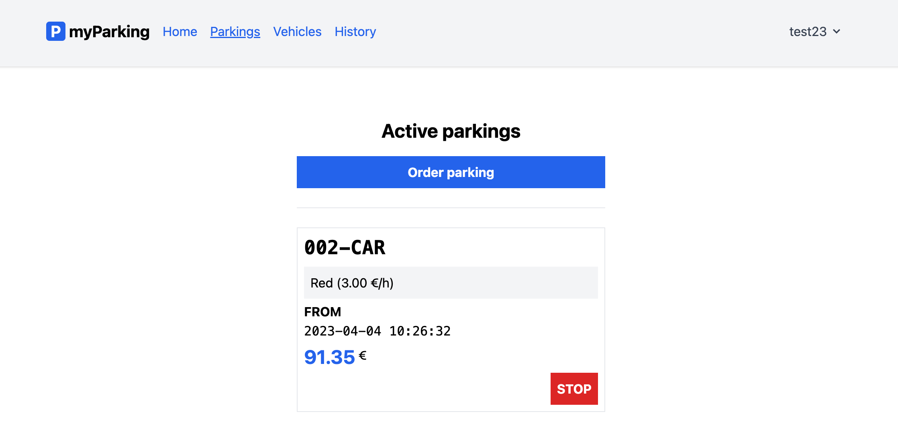

# Car Parking App (Frontend Client)

   

Приложение для парковки транспортного средства в выбранной зоне парковки (Frontend Client).

Используется вместе с [API](https://github.com/poymanov/laravel-daily-car-parking-app-api).

### Функционал

- Пользователи могут регистрироваться и аутентифицироваться;
- Добавление транспортных средств в учетную запись;
- Добавление парковочных зон для расчета стоимости парковки;
- Запуск сеанса парковки;
- Остановка сеанса парковки;
- Получение активных сеансов парковки аутентифицированного пользователя;
- Получение завершенных сеансов парковки аутентифицированного пользователя.

Подробности в [документации](docs/README.md).

### Предварительные требования

Для запуска приложения требуется **Docker** и **Docker Compose**.

### Основные команды

| Команда                | Описание                        |
|:-----------------------|:--------------------------------|
| `make init`            | Инициализация приложения        |
| `make up`              | Запуск приложения               |
| `make down`            | Остановка приложения            |
| `make frontend-format` | Форматирование кода             |
| `make frontend-lint`   | Проверка качества кода (ESLint) |

### Интерфейсы

Приложение - http://localhost:8082

---

Код написан в образовательных целях в рамках курса [Vue.js 3 Client Parking App: Step-by-Step](https://laraveldaily.com/course/vue-client-parking-app-laravel-api).
