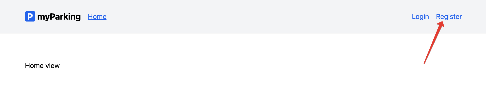
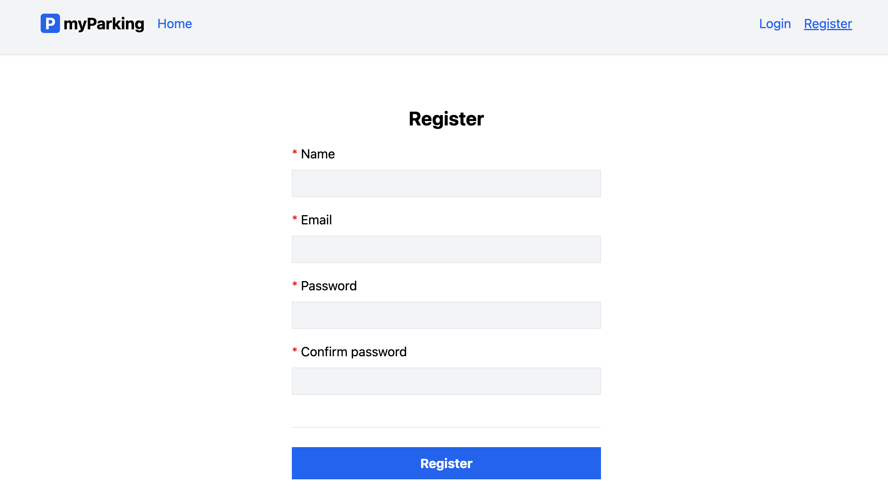

# Регистрация

Ссылка на регистрацию расположена в шапке приложения:

По клику открывается отдельная страница с формой:

* **Name** - произвольное имя пользователя
* **Email** - email пользователя, должен быть уникальным
* **Password** - пароль пользователя, длина не менее 8 символов
* **Confirm Password** - подтверждение пароля пользователя, должно быть равно значению в предыдущем поле

Все поля обязательны для заполнения.

После завершения процесса регистрации пользователь будет аутентифицирован и перенаправлен на страницу управления транспортными средствами.

---

