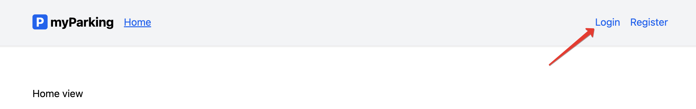
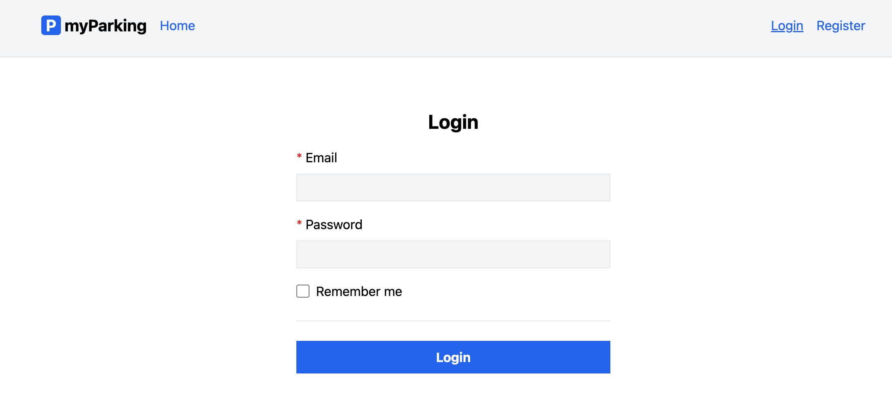
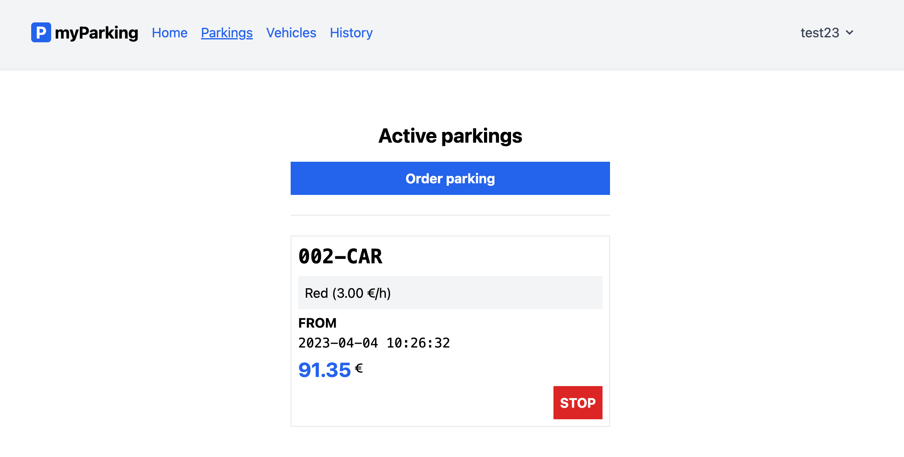

# Аутентификация

Ссылка на аутентификацию (*login*) расположена в шапке приложения:

По клику открывается отдельная страница с формой:

После успешной аутентификации происходит переадресация на страницу активных парковочных сеансов:

---

---

[<< Регистрация](../03-registration/README.md) | [Изменение данных профиля >>](../05-update-profile/README.md) | [**К оглавлению**](../README.md)