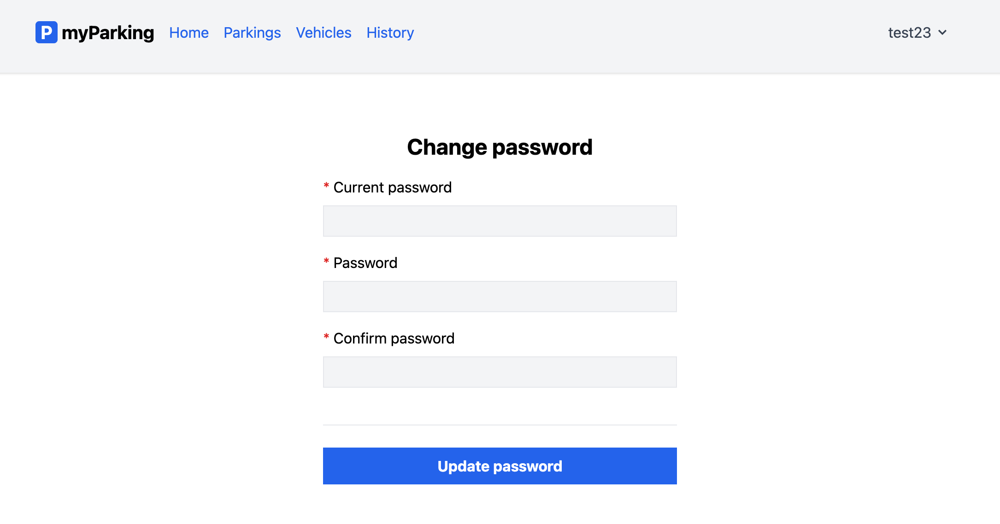

# Изменение пароля пользователя

Ссылка на изменение пароля пользователя расположена в шапке приложения, в меню аутентифицированного пользователя:

По клику открывается отдельная страница с формой, где нужно указать старый пароль и новый с подтверждением:

---
