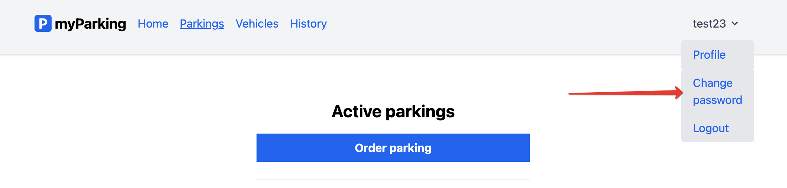

# Изменение пароля пользователя

Ссылка на изменение пароля пользователя расположена в шапке приложения, в меню аутентифицированного пользователя:

По клику открывается отдельная страница с формой, где нужно указать старый пароль и новый с подтверждением:

---

[<< Изменение данных профиля](../05-update-profile/README.md) | [Завершение пользовательского сеанса >>](../07-logout/README.md) | [**К оглавлению**](../README.md)