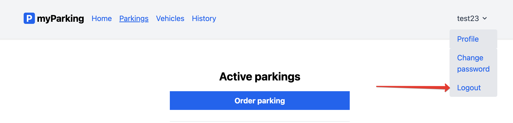

# Завершение пользовательского сеанса

Ссылка на завершения пользовательского сеанса (*logout*) расположена в шапке приложения, в меню аутентифицированного пользователя:

---

[<< Изменение пароля пользователя](../06-change-password/README.md) | [Управление транспортными средствами >>](../08-manage-vehicles/README.md) | [**К оглавлению**](../README.md)