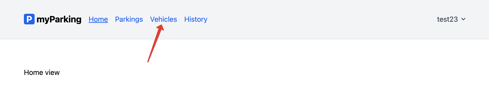
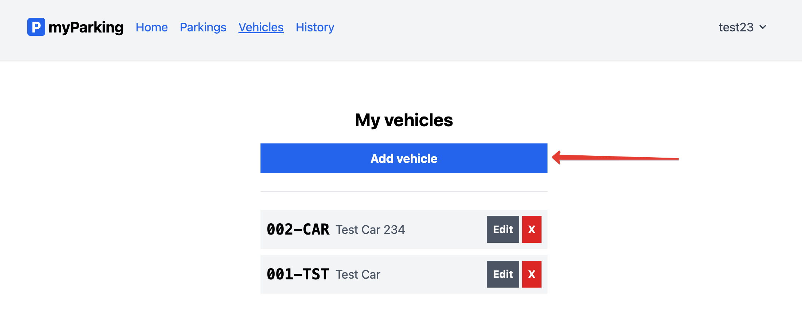
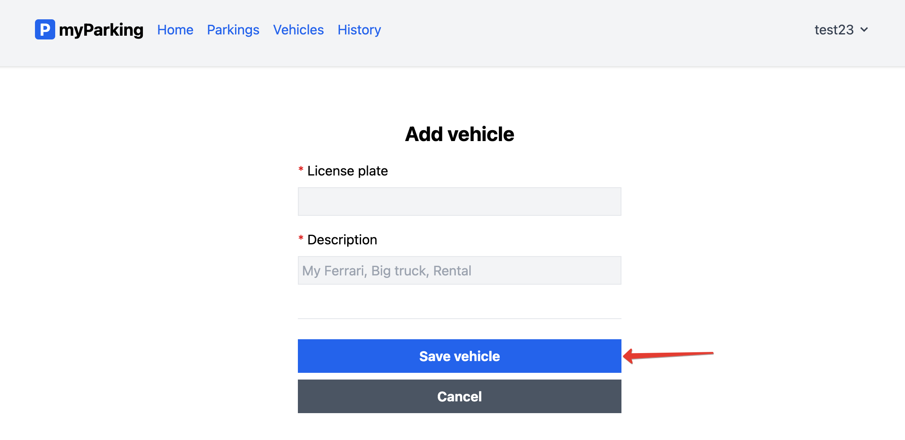
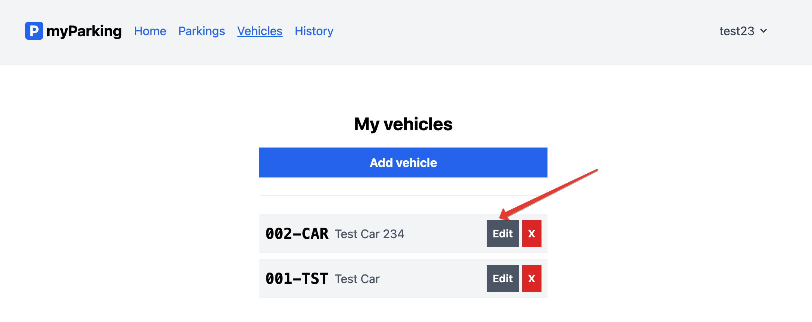
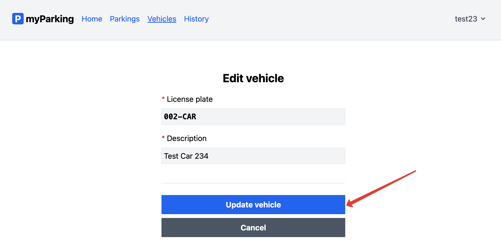
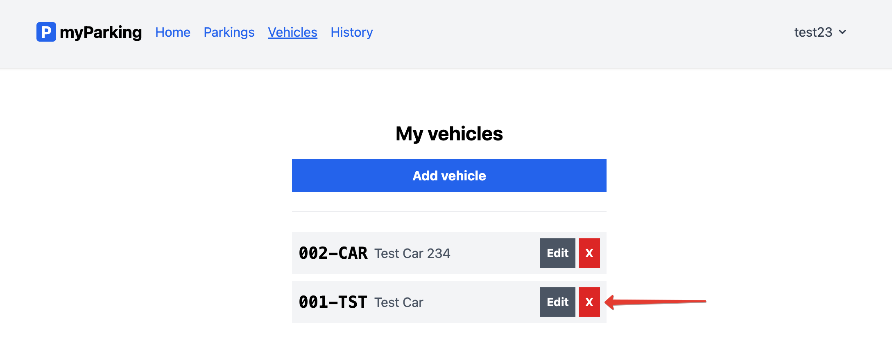

# Управление транспортными средствами

Перейти на страницу управления транспортными средствами можно из главного меню приложения:

Здесь можно добавить транспортное средство:

Отредактировать уже существующее:

И также удалить уже существующее транспортное средство:

