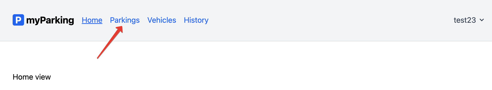
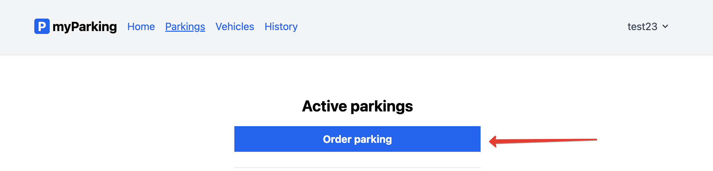
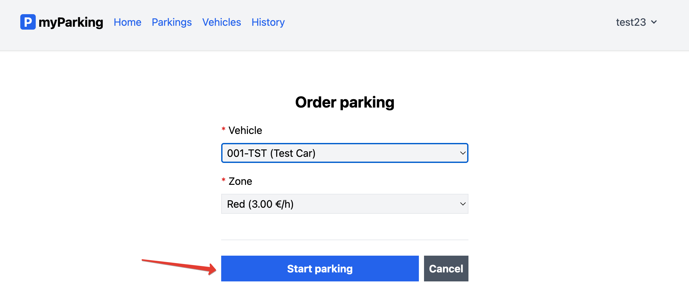
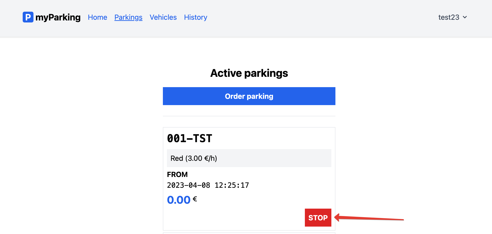

# Управление парковочными сеансами

Перейти на страницу управления парковочными сеансами можно из главного меню приложения:

Чтобы начать парковочный сеанс, нужно нажать кнопку **"Order parking"**:

И выбрать транспортное средство и зону парковки:

Парковочный сеанс появится на странице активных парковочных сеансов.

Остановить его можно с помощью соответствующей кнопки:

